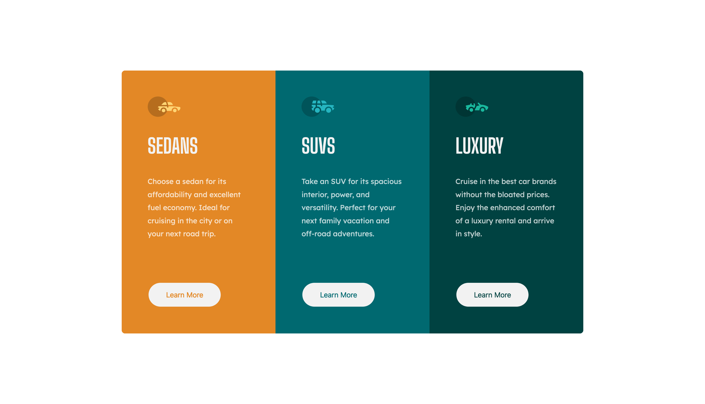

# Frontend Mentor - 3-column preview card component solution

This is a solution to the [Stats preview card component challenge on Frontend Mentor](https://www.frontendmentor.io/challenges/stats-preview-card-component-8JqbgoU62).

Frontend Mentor challenges are aimed at improving coding skills by challenging it's users to build projects from realistic briefs.

## Table of contents

- [Overview](#overview)
  - [The challenge](#the-challenge)
  - [Screenshot](#solution-screenshot)
  - [Project links](#links)
- [My process](#my-process)
  - [Built with](#built-with)
  - [What I learned](#what-i-learned)
  - [Continued development](#continued-development)
  - [Useful resources](#useful-resources)
- [Author](#author)
- [Acknowledgments](#acknowledgments)

## Overview

A challenge to build a card componenet to a client's Brief. Solution coded by Etienne Desfontaines, using HTML and Sass.

### The challenge

Build out this card componenet and get it looking as close to the [design](./design) as possible - use any tools you like.

Follow the supplied [style guide.](./style-guide.md)

Users should be able to:

- View the optimal layout depending on their device's screen size:
  desktop: 1440px wide.
  mobile: 375px wide.

- See hover states for interactive elements.

### Solution screenshot



### Links

- Solution URL: [Solution URL](https://github.com/etiennedesfontaines/frontend-mentor/tree/readme/newbie/3-column-preview-card-component-main)

- Live Site URL: [Live site URL](https://3-column-preview-card-component-solution-etiennedesfontaines.netlify.app/)

## My process

1. Create new Github repo branch.
2. Paper-sketch project overview.
3. Structure HTML (semantically).
4. Styling (Sass).
5. Responsiveness (media queries).
6. Deploy site (Netlify).
7. Readme.
8. Push to github and submit on frontend mentore.

### Built with

- Semantic HTML5 markup
- SCSS custom properties
- Flexbox
- Desktop-first workflow

### What I learned

Sass basics:

-Partials
A partial is a Sass file named with a leading underscore. e.g
\_global.scss
\_desktop.scss
\_mobile.scss

```scss
@import "global";
@import "desktop";
@import "mobile";
```

-Variables

```scss
$variable-name: hsl(31, 77%, 52%);
```

-Mixins
Mixins allows the grouping of css variables that you want to reuse throught your site.

A mixin is declared as follows:

```scss
@mixin flex($direction, $justify, $align, $wrap) {
	display: flex;
	flex-direction: $direction;
	justify-content: $justify;
	align-items: $align;
	flex-wrap: $wrap;
}
```

A mixin is called as follows:

```scss
@include flex(column, center, stretch, wrap);
```

-Nesting

```scss
.suv {
	background: $suv-cyan;
	border: 0.2rem solid $suv-cyan;

	button {
		color: $suv-cyan;
		border: 0.2rem solid $suv-cyan;

		&:hover {
			border: 0.2rem solid $light-gray;
			background: transparent;
			color: $light-gray;
		}
	}
}
```

### Continued development

1. I would like to become more familiar with Sass, and fluent in using it. It is an extremely concise way to write CSS and the compiler esures any styles declared are widely compatible.

2. Continue challenging myslef with Frontend Mentore challenges.

3. Make time for code reviews.

4. Become active in dev communities.

### Useful resources

- [Sass basics](https://sass-lang.com/guide) - This document is a concise outline of all the basics needed to start writing Sass. I strongly recommend it as a powerful time saving, compatability ensuring styling tool.

## Author

- Frontend Mentor - [@etiennedesfontaines](https://www.frontendmentor.io/profile/etiennedesfontaines)
- GitHub - [etiennedesfontaines](https://github.com/etiennedesfontaines)
- Exercism - [Etienne Desfontaines](https://exercism.io/profiles/etiennedesfontaines)
- Website - [Etienne Desfontaines](#)

## Acknowledgments

To the dev community as a whole - Thank you for all the incredible resources that make self-study possible.
