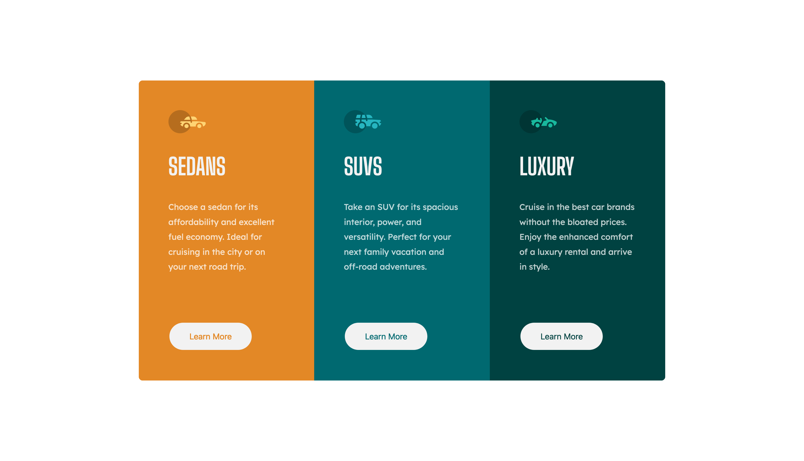

# 3-column preview card component solution



## Table of contents

- [Overview](#overview)
- [Project links](#links)
- [Built with](#built-with)
- [My process](#my-process)
- [What I learned](#what-i-learned)
- [Acknowledgments](#acknowledgments)
- [Author](#etienne-desfontaines)

## Overview

A challenge to build a 3-column preview card component.

Use any tools to actualize this [design](./design).

Please be sure to follow the supplied [style guide.](./style-guide.md).

Users should be able to view the optimal layout depending on their device's screen size.

### Links

- [Live site URL](https://stats-preview-card-component-solution-etiennedesfontaines.netlify.app/).

## Built with

- Semantic HTML5
- CSS (Sass compiled)
  - Flexbox

## My process

#### HTML structure

I considered my HTML from two angles:

- Semantically to increase accessibility and aid search engine optimisation.
- Structurly, to ensure that it makes creating the supplied design as easy as possible.

#### CSS styling

I followed a mobile first approach for my CSS styling.

## What I learned

### Sass

- Partials
  A partial is a Sass file named with a leading underscore. e.g
  \_global.scss
  \_desktop.scss
  \_mobile.scss

Partials can be imported to structure your styling into easy to find categories. They keep your code relevant and concise.

```scss
@import "global";
@import "desktop";
@import "mobile";
```

- Variables
  Help avoid verbose code and make changing styling properties accross large projects very efficient.
  ```scss
  $variable-name: hsl(31, 77%, 52%);
  ```
- Mixins
  Mixins allow the grouping of css variables that you want to reuse throughout your site.

  A mixin is declared as follows:

  ```scss
  @mixin flex($direction, $justify, $align, $wrap) {
  	display: flex;
  	flex-direction: $direction;
  	justify-content: $justify;
  	align-items: $align;
  	flex-wrap: $wrap;
  }
  ```

  And can later be called:

  ```scss
  @include flex(column, center, stretch, wrap);
  ```

  - Nesting

  ```scss
  .suv {
  	background: $suv-cyan;
  	border: 0.2rem solid $suv-cyan;

  	button {
  		color: $suv-cyan;
  		border: 0.2rem solid $suv-cyan;

  		&:hover {
  			border: 0.2rem solid $light-gray;
  			background: transparent;
  			color: $light-gray;
  		}
  	}
  }
  ```

## Acknowledgments

The Sass team for the great documentation and an awsome CSS compiler. It makes browser compatibility a breeze.

## Etienne Desfontaines

- Frontend Mentor - [@etiennedesfontaines](https://www.frontendmentor.io/profile/etiennedesfontaines)

- Exercism - [Etienne Desfontaines](https://exercism.io/profiles/etiennedesfontaines)
- Other social...
