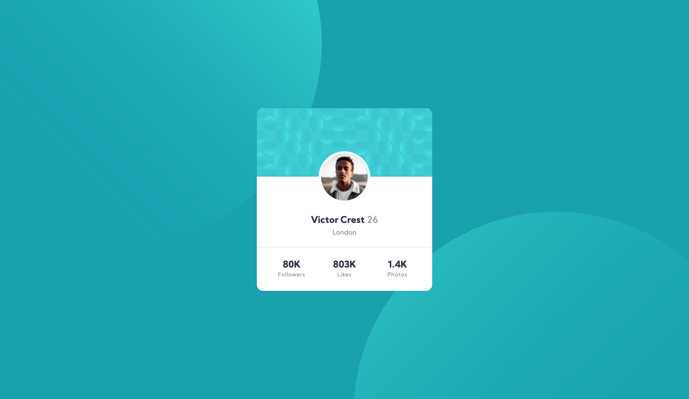

# Frontend Mentor - Profile card component solution

This is a solution to the [Profile card component challenge on Frontend Mentor](https://www.frontendmentor.io/challenges/profile-card-component-cfArpWshJ).

Frontend Mentor challenges are aimed at improving coding skills by challenging its users to build projects from realistic briefs.

## Table of contents

- [Overview](#overview)
  - [The challenge](#the-challenge)
  - [Solution screenshot](#solution-screenshot)
  - [Project links](#links)
- [My process](#my-process)
  - [Built with](#built-with)
  - [What I learned](#what-i-learned)
  - [Continued development](#continued-development)
  - [Useful resources](#useful-resources)
- [Author](#author)
- [Acknowledgments](#acknowledgments)

## Overview

A challenge to build a card componenet to a client's Brief. Solution coded by Etienne Desfontaines, using HTML and Sass.

### The challenge

Build out this card componenet and get it looking as close to the [design](./design) as possible - use any tools you like.

Follow the supplied [style guide.](./style-guide.md)

Users should be able to:

- View the optimal layout depending on their device's screen size.

### Solution screenshot

### Links

- Solution URL: [solution URL](https://github.com/etiennedesfontaines/frontend-mentor/tree/main/newbie/profile-card-component-main)
- Live Site URL: [live site URL](https://profile-card-component-solution-etiennedesfontaines.netlify.app/)

## My process

1. Create new Github repo branch.
2. Paper-sketch project overview.
3. Structure HTML (semantically).
4. Styling (Sass).
5. Responsiveness (media queries).
6. Deploy site (Netlify).
7. Readme.
8. Push to github and submit on frontend mentore.

### Built with

- Semantic HTML5 markup
- Sass custom properties
- Flexbox
- CSS Grid
- Mobile-first workflow

### What I learned

To make some designs responsive is more challenging. It requires attention to detail with proficient use of media queries.

### Continued development

1. I would like to continue developing my use of sass and emmet.

2. I intend to continue challenging and refining my skills through Frontend Mentor.

3. Deepening my JS problem solving skills through exercism.

4. Teaching others, doing code reviews and making an effort to engage with the online dev community more regularly.

### Useful resources

-[Notion](https://www.notion.so/product?utm_source=google&utm_campaign=2075789713&utm_medium=80211061801&utm_content=453572180157&utm_term=notion&targetid=kwd-312974742&gclid=EAIaIQobChMImv-0q5fR8QIVgrh3Ch3OaAB8EAAYASAAEgL_BvD_BwE) - Notion has formed an exceptionally powerful part of my frontend education resources. I use it to structure my learning and order my notes.

## Author

- Frontend Mentor - [@etiennedesfontaines](https://www.frontendmentor.io/profile/etiennedesfontaines)
- GitHub - [etiennedesfontaines](https://github.com/etiennedesfontaines)
- Exercism - [Etienne Desfontaines](https://exercism.io/profiles/etiennedesfontaines)

## Acknowledgments

To the dev community as a whole - Thank you for all the incredible resources that make self-study possible.
